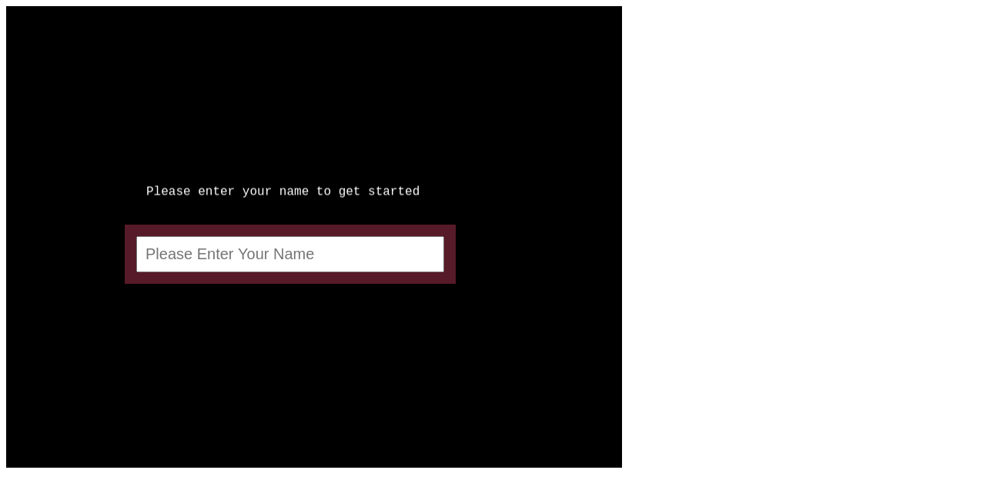
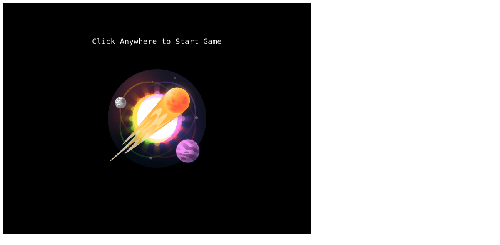
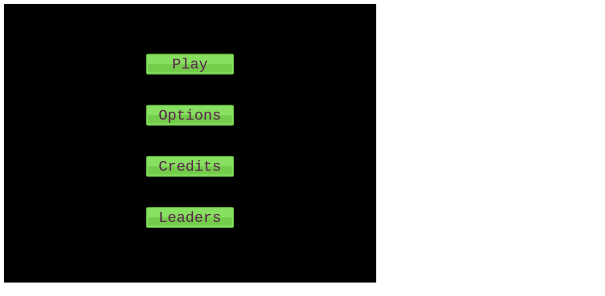
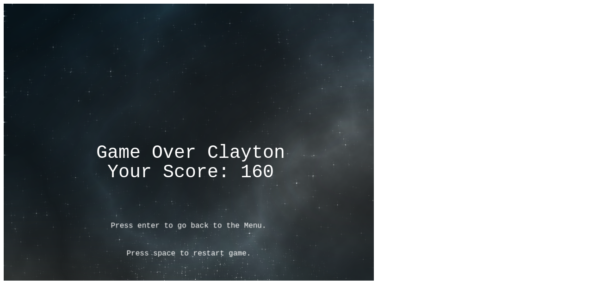

# Game Design Document:

## Introducton
Rue Space Shooter is a final project in the Microverse JavaScript curriculum, which has been developed using Phaser 3 Framework and Vanilla JavaScript concepts.

## Game Structure
This section breaks down the instructions on how to play the game.
# Player Name Input Page
- On this page, the Player is prompted to 'Please Enter Your Name' and press `ENTER` 

# Loading Page with Logo
- The Player is automatically redirected to the following page where they can `Click` anywhere on the screen to start the game to go to menu options.

# Menu page
- The Player is presented with four menu buttons :  -

1. Click `Play` to be directed to start playing the game.
2. Click `Options` to the enable music, which by default is unchecked.
3. Click `Credits` to view Author details.
4. Click `leaders` to view the players with the highest scores in the top 10 Leaderboard.

# Game page

- Use `LEFT` and `RIGHT` arrow keys to influence the direction of the ship'
- Press `SPACE` bar to release laser bullets towards the enemy bugs.
- Alternatively, `RIGHT CLICK` on your mouse to achieve shooting effect and movement of the ship.

# Game Over Page

- Press `ENTER` to go back to the Menu.
- Press `SPACE` to restart the game
