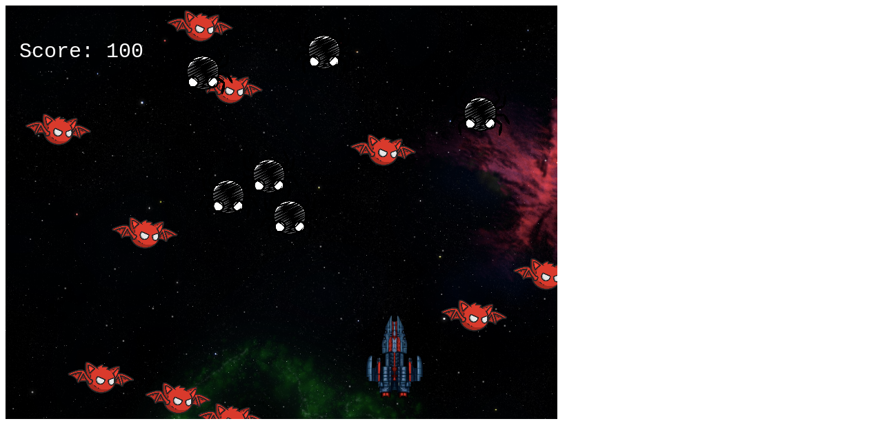

# Phaser-3_Shooter_Capstone_Game
The Shooter_Game is creatively designed by implementing  the Phaser-3 Framework concepts.

# LIVE DEMO 
[Live Demo](https://rawcdn.githack.com/Rumbie-Mudzie7/Weather-App/9c103cd267228bfffdad7814a8381bd629b79c1f/dist/index.html)

Rue Space Shooter project demonstrates the Author's understanding of Game development through the Phaser 3 Framework. Phaser 3 is the next generation of the Phaser Game Framework. Every last element has been rebuilt from scratch using a fully modular structure, combined with a data-orientated approach. It includes a brand-new custom WebGL renderer designed specifically for the needs of modern 2D games.  

In this milestone, the following procedures were implemented, based on the final JavaScript Capstone specifications and requirements: -

1. Writing the functions that hit the API to take a location and return the weather data for  that location.

2. Writing the functions that process the JSON data being obtained from the API and returning an object with only the data required for the app.

3. Setting up a simple form that lets users input their location and fetch the weather information.

4. Displaying the information on your webpage.

## Built With

- HTML5, JavaScript, ES6 and CSS3
- OpenWeatherMap API
- JSON

## Getting Started

To get a local copy up and running follow these simple example steps.

### Prerequisites

- Code Editor of your choice
- Initialize npm by running `npm init` in your project terminal.
- Install and run webpack. For guideance on installing and running webpack, [ please visit](https://actualize.teachable.com/courses/347362/lectures/5396444)
- Run `npm install`.

### Setup

- To clone the repo to your local repository. Follow this steps
- <code> git clone https://github.com/Rumbie-Mudzie7/Weather-App.git</code>
- <code> cd Weather-App</code>
- Open `src/index.js` in your preferred browser.

## Author

:bust_in_silhouette: **Rumbidzayi Mudziviri**
- Github: [@Rumbie-Mudzie7](https://github.com/Rumbie-Mudzie7)
- Twitter: [@RumbidzayiMudz3](https://twitter.com/RumbidzayiMudz3)
- Linkedin: [rumbidzayimudziviri](https://www.linkedin.com/in/rumbidzayi-mudziviri)
- rumbiemudzie@gmail.com

## :handshake: Contributing

There are two ways of contributing to this project:
1.  If you see something wrong or not working, please check [the issue tracker section](https://github.com/Rumbie-Mudzie7/Weather-App/issues), if that problem you met is not in already opened issues then open the issue by clicking on `new issue` button.
2.  If you have a solution to that, and you are willing to work on it, follow the below steps to contribute:
    1.  Fork this repository
    1.  Clone it on your local computer by running `https://github.com/Rumbie-Mudzie7/Weather-App.git` __Replace *Rumbie-Mudzie7* with the username you use on github__
    1.  Open the cloned repository which appears as a folder on your local computer with your favorite code editor
    1.  Create a separate branch off the *master branch*,
    1.  Write your codes which fix the issue you found
    1.  Commit and push the branch you created
    1.  Raise a pull request, comparing your new created branch with our original master branch [here](https://github.com/Rumbie-Mudzie7/Weather-App)

## Show your support

Give a :star:️ if you like this project!

## Acknowledgments
[Webpack tutorial](https://actualize.teachable.com/courses/347362/lectures/5396444)
[Microverse](https://www.microverse.org)
[Odin Project](https://www.theodinproject.com/courses/javascript/lessons/weather-app)

## :memo: License

MIT
